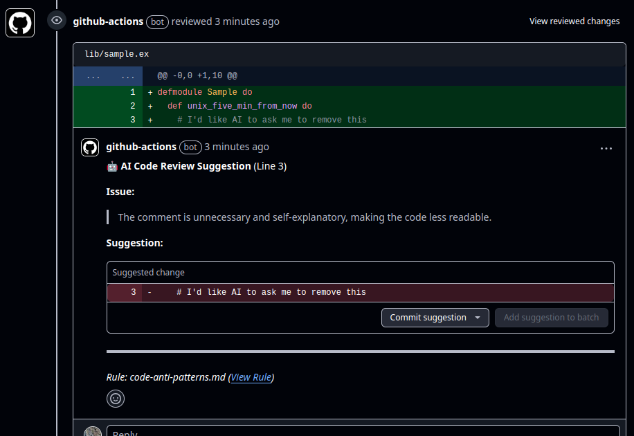
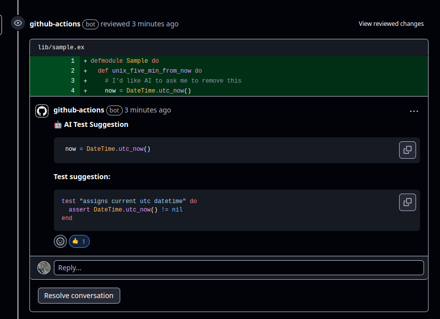

# AI Code Review & Test Generation CI

This project implements GitHub Actions workflows to automate aspects of code review and testing using AI.

## Features

1. AI Code Review
   Custom Rule Enforcement: Define project-specific coding conventions and anti-patterns in markdown files within an .ai-code-rules/ directory in your repository. These rules can capture nuances beyond static analysis capabilities (inspired by conventions like Elixir's anti-patterns).
   An AI-generated suggestion on how to modify the code to comply with the rule, allowing developers to potentially accept the suggestion directly.
   
2. AI Test Writer
   Test Coverage Monitoring: A GitHub Action monitors test coverage for newly added lines of code in pull requests.
   Automated Test Generation/Suggestion: If new lines lack test coverage, the action adds comment with Suggestions.
   

# AI code review workflow

## Main workflow

```
+----------------------------+
| Print info & parse args   |
| - dry_run?                |
+----------------------------+
           |
           v
+----------------------------+
| load_rules(@rules_dir)    |
| -> reads .md files        |
+----------------------------+
           |
           v
+----------------------------+
| GitUtils.get_pr_diff()    |
| -> gets diff from git     |
+----------------------------+
           |
           v
+----------------------------+
| DiffParser.parse(diff)    |
| -> find added lines       |
+----------------------------+
           |
           v
+----------------------------+
| chunk_lines(...)          |
| -> split into ~12k char   |
|    chunks for AI review   |
+----------------------------+

```

## AI Review loop

```
for each chunk:
  +------------------------------+
  | build_prompt(chunk, rules)  |
  +------------------------------+
            |
            v
  +------------------------------+
  | review_code_with_gemini/1   |
  | -> sends prompt to API      |
  | -> parses JSON violations   |
  +------------------------------+
            |
            v
  [violations collected here]

```

## Commenting on GH

```
if dry_run?:
  +------------------------------------+
  | Print violations to stdout         |
  | Show which would be commented on  |
  +------------------------------------+
else:
  +------------------------------------+
  | Get PR number from GitHub API     |
  | Post comments for each violation  |
  +------------------------------------+

```

# Suggest missing tests workflow

## Coverage & diff parsing

```
+------------------------------------------------+
| Read and decode `cover/excoveralls.json`       |
| → Extract list of source_files                 |
+------------------------------------------------+
                 |
                 v
+------------------------------------------------+
| Build a coverage map based on git diff         |
| Map[file_path] => %{coverage, source_lines}    |
+------------------------------------------------+
                 |
                 v
+------------------------------------------------+
| Filter added lines where coverage == 0         |
+------------------------------------------------+
                 |
         [If none found]
                 |
                 v
+------------------------------------------------+
| Print "No uncovered lines" and exit            |
+------------------------------------------------+

```

## Chunking and AI Suggestions

```
+------------------------------------------------+
| Split uncovered added lines into chunks        |
| (~15k chars per chunk)                         |
+------------------------------------------------+
                 |
                 v
+------------------------------------------------+
| For each chunk:                                |
| → Build AI prompt                              |
| → Send to Gemini API                           |
| → Decode JSON response                         |
| → Extract list of suggestions                  |
+------------------------------------------------+
```

## Output & GitHub Comments

```
+------------------------------------------------+
| If dry_run?:                                   |
|   Print suggestions to stdout                  |
| Else:                                          |
|   Get PR number                                |
|   Post suggestions as PR comments              |
+------------------------------------------------+
                 |
                 v
+------------------------------------------------+
| Print summary: Total suggestions posted        |
+------------------------------------------------+
```
